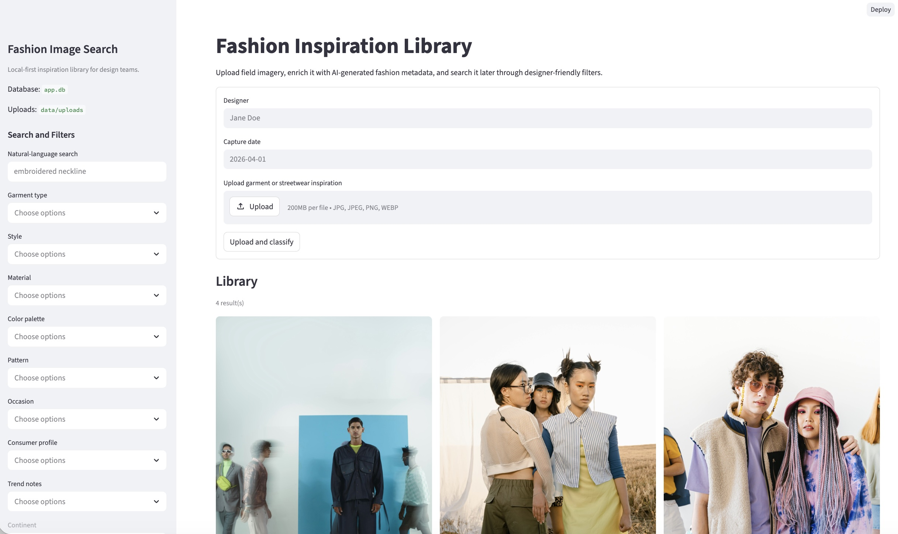

# Fashion Image Search

A lightweight Streamlit app for uploading, classifying, organizing, and searching fashion inspiration photos with AI-assisted metadata.

## Overview

This prototype is designed for fashion designers who collect inspiration imagery in the field and need a fast way to turn scattered photos into a reusable library. The app supports local upload, AI-assisted classification, search and filtering across structured metadata, and designer-authored annotations.

## App Preview




The app includes:

- a Streamlit entrypoint
- SQLite storage setup
- image upload and local asset persistence
- AI classification orchestration with OpenAI-first behavior and local fallback metadata generation
- searchable library grid with dynamically generated filters
- designer annotations stored separately from AI-generated metadata
- evaluation scripts plus both starter and 56-image labeled datasets under `eval/`
- pytest test layout

## Tech Stack

- Python 3.9+
- Streamlit
- SQLite
- OpenAI API
- pytest

## Local Setup

1. Create and activate a virtual environment.
2. Install dependencies into the environment:

```bash
./.venv/bin/pip install -e '.[dev]'
```

3. Copy environment variables:

```bash
cp .env.example .env
```

4. Add your API key to `.env`.

5. Run the app:

```bash
./.venv/bin/streamlit run app/main.py
```

6. Run tests:

```bash
./.venv/bin/python -m pytest
```

7. Run evaluation:

Fallback-allowed:

```bash
./.venv/bin/python fashion_eval.py --dataset eval/dataset/starter_labels.jsonl --output eval/results/latest_report.json
```

OpenAI-required:

```bash
./.venv/bin/python fashion_eval.py --require-openai --dataset eval/dataset/examples_labels.jsonl --output eval/results/examples_report.json
```

## Repository Structure

```text
app/       Streamlit app, data access, and service code
eval/      Evaluation scripts and labeled test set
tests/     Unit, integration, and end-to-end style tests
data/      Local runtime storage for uploaded assets
```

## Architecture Notes

- The app will store uploaded images on disk and structured metadata in SQLite.
- AI-generated descriptions and parsed attributes will be stored separately from designer-authored annotations.
- Filters will be generated dynamically from the stored metadata to avoid hardcoded facets.
- The evaluation workflow uses a JSONL labeled dataset and regenerates a structured report with per-attribute accuracy and sample failure cases.
- The app has two classification paths: a preferred OpenAI multimodal path and a heuristic fallback path used when API calls fail or are disabled.
- Evaluation can now be run in either mode, and `--require-openai` prevents silent fallback during model-quality benchmarking.

## Product Trade-Offs

- Streamlit keeps the UI lightweight and fast to iterate on, which fits the one-day constraint better than a heavier frontend stack.
- SQLite and local file storage keep setup minimal and make the prototype easy to run locally without cloud infrastructure.
- The app uses an OpenAI-first classification path when an API key is available, but falls back to heuristics so the full workflow can still be demoed offline.
- Search is currently substring-based over AI descriptions and annotations rather than true semantic retrieval. This keeps implementation simple but limits natural-language flexibility.

## Evaluation Summary

Two evaluation modes are supported:

- `fallback-allowed`: useful for local plumbing checks and offline demos
- `--require-openai`: required when you want to measure the real multimodal model and fail if OpenAI is unavailable

Starter fallback evaluation was generated with:

```bash
./.venv/bin/python fashion_eval.py --dataset eval/dataset/starter_labels.jsonl --output eval/results/latest_report.json
```

Starter-set results on 3 labeled samples:

- `garment_type`, `style`, `material`, `pattern`, `season`, `occasion`, `consumer_profile`, `city`, and `trend_notes` scored `1.0` on the labeled rows where those attributes were present.
- `color_palette` scored `0.0` on `3/3` measured rows.
- `continent` and `country` were not measured in the starter set because no labeled expectations were provided yet.

Interpretation:

- The current fallback classifier performs well when filename cues are strong, which is why garment type, city, and occasion look good in the starter run.
- Color palette is the weakest area right now. The heuristic color extraction is intentionally simple and does not yet align well with the labeled expectations.
- This starter report is useful as a plumbing check, but it is not a meaningful model benchmark yet. A real submission should expand the labeled set to 50-100 diverse images.

Expanded examples-set OpenAI evaluation:

- dataset: `56` manually labeled images from `data/examples/`
- labels: `eval/dataset/examples_labels.jsonl`
- report: `eval/results/examples_report.json`

Measured OpenAI results on that set after synonym-aware normalization:

- `garment_type`: `24 / 56 = 0.4286`
- `style`: `18 / 56 = 0.3214`
- `material`: `17 / 47 = 0.3617`
- `occasion`: `31 / 56 = 0.5536`
- overall micro accuracy across measured core-fashion labels: `0.4186`
- overall macro accuracy across measured core-fashion labels: `0.4163`

Location context was not scored on the examples set because city/country ground truth could not be assigned reliably from image content alone.

Interpretation:

- The OpenAI model is extracting useful fashion structure from images, especially for `occasion`.
- Raw exact-match scoring was too strict for fashion phrasing, so the evaluator now normalizes common synonyms such as `matching set` vs `set` and `street style` vs `streetwear`.
- `style` and `material` remain the hardest fields because the model often returns richer descriptive phrases than the manual label taxonomy.

## Evaluation Workflow

1. Add evaluation images under `eval/dataset/images/`.
2. Label expected metadata in `eval/dataset/starter_labels.jsonl` or another JSONL file with the same schema.
3. Run:

```bash
./.venv/bin/python fashion_eval.py --dataset eval/dataset/starter_labels.jsonl --output eval/results/latest_report.json
```

4. Inspect the generated report in `eval/results/latest_report.json`.
5. If you want to bypass OpenAI and force the fallback classifier:

```bash
OPENAI_API_KEY='' ./.venv/bin/python fashion_eval.py --dataset eval/dataset/examples_labels.jsonl --output eval/results/examples_report.json
```

6. If you want to evaluate only the OpenAI model and fail on any fallback:

```bash
./.venv/bin/python fashion_eval.py --require-openai --dataset eval/dataset/examples_labels.jsonl --output eval/results/examples_report.json
```

## Testing

The current automated coverage includes:

- unit parsing coverage for model output normalization
- integration tests for upload persistence and location/time filter behavior
- annotation search coverage
- an end-to-end style upload -> classify -> filter flow

Run the suite with:

```bash
./.venv/bin/python -m pytest
```

Current status: `7 passed`

## Known Limitations

- Search is lexical rather than embedding-based, so natural-language matching is still shallow.
- The fallback classifier relies heavily on filename cues and lightweight color heuristics, which is useful for demoing but not production quality.
- Location inference is only as strong as the model response or filename hints; there is no geocoding or EXIF enrichment yet.
- The starter evaluation set is intentionally tiny, but the repository now also includes a 56-image manually labeled benchmark in `eval/dataset/examples_labels.jsonl`.
- There are two non-blocking dependency warnings still visible in test runs: `imghdr` deprecation and a Pillow `getdata()` deprecation path.

## Next Steps

- replace the starter eval set with a real 50-100 image benchmark
- improve color palette extraction and list-field scoring
- upgrade search from substring matching to semantic retrieval
- add richer model prompting and stronger structured validation for OpenAI responses
